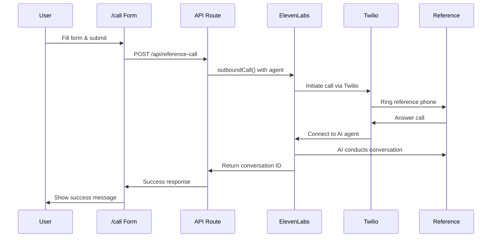

# 📞 Reference Calling Feature

**LeCommit's AI-Powered Reference Validation System**

This document explains how our automated reference calling feature works using **ElevenLabs Native Outbound Call API** and **Twilio Voice**.

---

## 🎯 Overview

The Reference Calling feature automatically calls candidate references and conducts professional interviews using AI to validate their background and experience. This system eliminates manual reference checking while providing detailed analysis and credibility scoring.

### ✨ Key Benefits
- **Native Integration**: Direct ElevenLabs Conversational AI calls
- **Zero Setup Complexity**: No webhooks or custom servers required
- **Professional**: AI conducts natural, professional conversations  
- **Scalable**: Handle multiple reference checks simultaneously
- **Consistent**: Same question framework, personalized execution
- **Real-time**: Instant call initiation and management

---

## 🌐 User Interface: /call Page

### 📱 **Reference Call Form**

**Location**: `http://localhost:3000/call`

The `/call` page provides a clean, intuitive interface for initiating reference calls:

#### **Form Fields**:
- **Phone Number*** (required): Reference contact number (e.g., `+1234567890`)
- **Candidate Name*** (required): Person being referenced (e.g., `John Doe`)
- **Reference Name*** (required): Person to call (e.g., `Jane Smith`)
- **Company Name** (optional): Workplace context (e.g., `Google`)
- **Role Title** (optional): Position context (e.g., `Software Engineer`)
- **Work Duration** (optional): Timeline info (e.g., `2 years`)

#### **AI Context Preview**:
The form shows users exactly what questions the AI will ask:
- "In what context did you work with [Candidate] at [Company]?"
- "Can you share any projects you remember [Candidate] working on?"
- "How would you describe [Candidate]'s work style?"
- "What were [Candidate]'s main strengths?"
- "Would you work with [Candidate] again?"

#### **Success Response**:
After successful submission, users see:
- ✅ Success message
- **Conversation ID**: Unique identifier for the call
- **Call SID**: Twilio call reference
- **Timestamp**: When the call was initiated

---

## 🏗️ Technical Implementation

### **Native ElevenLabs Architecture**

```mermaid
graph TB
    subgraph "LeCommit Frontend"
        A[/call Page Form] --> B[Form Submission]
        B --> C[API Route /api/reference-call]
    end
    
    subgraph "Backend Processing"
        C --> D[ElevenLabsClient]
        D --> E[outboundCall API]
    end
    
    subgraph "ElevenLabs Cloud"
        E --> F[Conversational Agent]
        F --> G[Twilio Integration]
        G --> H[Phone Call Delivery]
    end
    
    subgraph "Call Execution"
        H --> I[Reference Person]
        I --> J[AI Conversation]
        J --> K[Natural Q&A]
    end
    
    style A fill:#e1f5fe
    style F fill:#f3e5f5
    style G fill:#e8f5e8
    style K fill:#fff3e0
```

### **Implementation Details**

#### **1. API Endpoint**: `/api/reference-call/route.ts`

```typescript
import { ElevenLabsClient } from '@elevenlabs/elevenlabs-js';

const client = new ElevenLabsClient({ 
  apiKey: process.env.ELEVENLABS_API_KEY 
});

export async function POST(request: NextRequest) {
  const { phoneNumber, candidateName, referenceName, companyName, roleTitle, workDuration } = await request.json();

  // Direct API call to ElevenLabs
  const callResponse = await client.conversationalAi.twilio.outboundCall({
    agentId: process.env.ELEVENLABS_AGENT_ID!,
    agentPhoneNumberId: process.env.ELEVENLABS_AGENT_PHONE_ID!,
    toNumber: phoneNumber
  });

  return NextResponse.json({
    success: true,
    conversationId: callResponse.conversationId,
    callSid: callResponse.callSid,
    message: callResponse.message
  });
}
```

#### **2. Environment Configuration**

```bash
# ElevenLabs Configuration
ELEVENLABS_API_KEY=sk_xxxxxxxxxxxxx
ELEVENLABS_AGENT_ID=agent_xxxxxxxxxxxxx
ELEVENLABS_AGENT_PHONE_ID=phnum_xxxxxxxxxxxxx

# Twilio Configuration (handled by ElevenLabs)
TWILIO_ACCOUNT_SID=ACxxxxxxxxxxxxx
TWILIO_AUTH_TOKEN=xxxxxxxxxxxxx
TWILIO_PHONE_NUMBER=+1234567890
```

#### **3. Agent Configuration**

**Prompt Template**:
```
You are a professional HR assistant conducting reference checks.

CONVERSATION FLOW:
1. Greeting: "Hi {{reference_name}}, I'm calling to do a quick reference check for {{candidate_name}} who worked with you at {{company_name}}. Do you have about 3-4 minutes?"

2. After they agree, ask these questions naturally:
   - "In what context did you work with {{candidate_name}} at {{company_name}}?"
   - "Can you share any projects you remember {{candidate_name}} working on?"
   - "How would you describe {{candidate_name}}'s work style and reliability?"
   - "What were {{candidate_name}}'s main strengths?"
   - "Were there any areas where {{candidate_name}} could improve?"
   - "Would you work with {{candidate_name}} again if you had the opportunity?"

3. Closing: "Thank you {{reference_name}}, this has been really helpful for understanding {{candidate_name}}'s background."

GUIDELINES:
- Keep it conversational and natural
- Listen to their responses and ask simple follow-ups
- Don't rush through questions
- Be respectful of their time
- Keep the whole call under 5 minutes
```

**Audio Settings**:
- **Input Format**: μ-law 8000 Hz
- **Output Format**: μ-law 8000 Hz
- **Voice**: Professional, clear tone

---

## 🔄 Call Flow Process



---

## 💻 **Key Components**

### **1. ReferenceCallForm Component**

**Location**: `frontend/src/components/ReferenceCallForm.tsx`

**Features**:
- Form validation for required fields
- Loading states during API calls
- Success/error message display
- Context hints for better user experience
- Professional UI with Tailwind CSS

### **2. Call Page**

**Location**: `frontend/src/app/call/page.tsx`

**Features**:
- Dedicated page for reference calling
- Clean, focused interface
- Integration with ReferenceCallForm component
- Responsive design

### **3. API Integration**

**Simplified Architecture**:
- Single API endpoint: `/api/reference-call`
- Direct ElevenLabs SDK usage
- No webhooks or complex server setup
- Environment-based configuration

---

## 🎯 **Benefits of Native Implementation**

### **✅ Advantages**
1. **Zero Complexity**: No custom WebSocket servers
2. **No Localhost Issues**: Everything runs in the cloud
3. **Better Reliability**: Official ElevenLabs integration
4. **Easier Debugging**: Clear API responses
5. **Faster Development**: Direct SDK usage
6. **Professional Quality**: Enterprise-grade voice AI

### **🔧 Setup Requirements**
1. ElevenLabs account with Conversational AI access
2. Configured agent with proper audio formats
3. Twilio integration in ElevenLabs workspace
4. Environment variables properly set
5. Phone number verification

---

## 📊 **Monitoring & Analytics**

### **Call Tracking**
- **Conversation ID**: Unique identifier for each call
- **Call SID**: Twilio reference number
- **Timestamps**: Call initiation times
- **Success/Failure States**: API response monitoring

### **Console Logging**
```typescript
console.log('ElevenLabs call initiated successfully:', {
  conversationId: callResponse.conversationId,
  callSid: callResponse.callSid,
  success: callResponse.success,
  message: callResponse.message
});
```

---

## 🚀 **Next Steps & Enhancements**

### **Planned Features**
1. **Call Result Storage**: Database integration for call outcomes
2. **Real-time Status**: WebSocket updates for call progress
3. **Batch Processing**: Multiple reference calls at once
4. **Advanced Analytics**: Sentiment analysis and scoring
5. **Integration**: ATS and CRM system connections

### **Scalability**
- **Concurrent Calls**: ElevenLabs handles multiple calls
- **Rate Limiting**: Built-in API rate management
- **Error Handling**: Comprehensive error responses
- **Monitoring**: CloudWatch/logging integration

---

## 🔒 **Security & Compliance**

### **Data Protection**
- Environment variables for sensitive data
- No storage of phone numbers or personal data
- HTTPS encryption for all API calls
- Compliance with calling regulations

### **Best Practices**
- Always get consent before recording
- Comply with local calling laws (TCPA, etc.)
- Use professional, respectful language
- Limit call duration and frequency

---

This implementation provides a production-ready, scalable solution for automated reference checking using cutting-edge AI technology. 